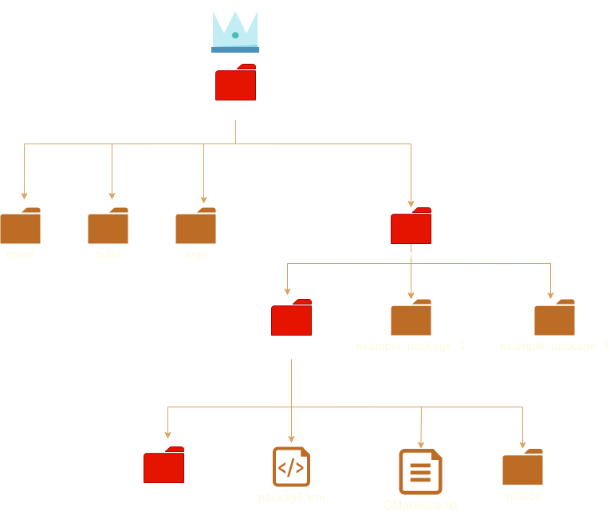
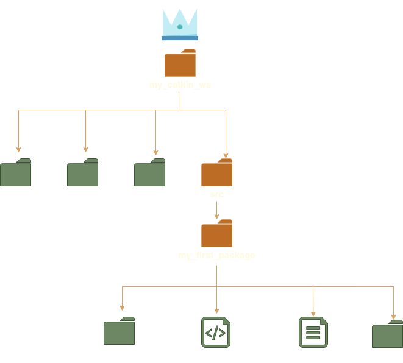

# The ROS system

### ROS Robot Operating System

The ROS system can be hard to grasp at first because of its layered architecture, this architecture is the result of many iterations and trails and errors from robot developers before you.  

There are easier ways of making your robot move or capture images but these features probably have already been done (probably better than you)  

ROS was born in an effort to stop reinventing the wheel in every robot project, it is a protocol if you adhere to it you will be able to use features from other developers, and share your code.

## chapter 0
### ROS hierarchical  architecture
&nbsp;   


>**Below every tangled hierarchy lies an inviolate level.**
>  
>  &nbsp; &nbsp; &nbsp; &nbsp; &nbsp; &nbsp;  &nbsp; &nbsp; &nbsp; &nbsp; &nbsp; &nbsp; &nbsp; &nbsp; &nbsp; &nbsp; &nbsp; &nbsp; &nbsp; &nbsp; --*Douglas Hofstadter*---

 


Illustration 0 shows an directory tree that could be found in a ROS workspace.  
In this example `catkin_ws` the highest level in the hierarchy is the workspace.
though all directories are useful and needed.  
For the sake of simplicity the directories in red are the ones we should focus.

### Do i need to create all these files manually ?
No most of all these files are built for you by `catkin`  
this is the command line tool provided by ROS.  
Like many despot kings `catkin` will behave poorly if you use it in the wrong directory level, **always use `catkin` command at the top level**
### catkin commands:  
*   `catkin init`  :    initialize a catkin workspace.
*   `catkin build` :    builds the project **TODO**
*   `catkin_create_package`: creates a package with the boilerplate files.
*   `catkin list`  :    lists all the packages in the workspace.
 

### where do i start ? 
very simple you start at the highest level. 
1.  Create an empty catkin workspace directory and a src directory inside it.  
    the workspace directory can be named anything we desire but the convention is to call it *catkin_ws* i will call it *my_catkin_ws*  because i like to break the rules.
```bash
   mkdir -p my_catkin_ws/src
```
2. Initialize the workspace:
```bash
   catkin init
```
3.  Make the workspace:
```bash
    catkin build
```
4.  Source the workspace AKA "sourcing the devil" (more on this later, for now follow this with a leap of faith )
```bash
   source devel/setup.bash
```
4.  Create your first package
```bash
   catkin_create_pkg my_first_package
```

If everything went well you should have a directory tree like shown below the folders in green show all the directories that are build for you by `catkin`
for now we should only focus on our package src directory. **"my_first_package/src"** this is were our code will live.

